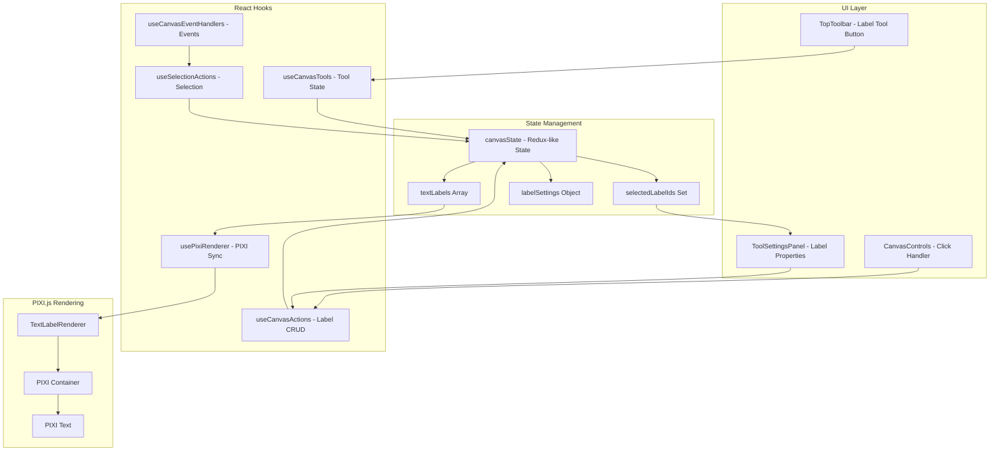

# Label System Architecture

## Overview

The label system in this canvas application allows users to create, edit, and manage text labels on an infinite canvas. Labels are interactive elements that can be selected, moved, styled, and edited. This document explains how the entire label system is architected and connected.

## Quick Start

### Creating a Label (User Perspective)
1. Click the "T" (Label) button in the top toolbar
2. Click anywhere on the canvas
3. Type your text in the Tool Settings Panel
4. Press Enter or click outside to confirm

### Creating a Label (Code Perspective)
```javascript
// Import required hooks
import { useCanvasActions } from './hooks/useCanvasActions';
import { useSelectionActions } from './hooks/useCanvasActions';

// Inside your component
const { canvasActions } = useCanvasActions();
const { selectionActions } = useSelectionActions();

// Create a label at position (100, 100)
const newLabel = canvasActions.addLabel(
  "Hello World",           // text
  { x: 100, y: 100 },     // position
  {                       // style settings
    fontSize: 16,
    fill: '#000000',
    fontFamily: 'Arial'
  }
);

// Select the new label
selectionActions.setLabelSelection([newLabel.id]);
```

### Accessing Label Data
```javascript
// Get all labels
const { textLabels } = useCanvasState();

// Get selected labels
const { selectedLabelIds } = useSelectionState();
const selectedLabels = textLabels.filter(label => 
  selectedLabelIds.has(label.id)
);

// Get label settings
const { labelSettings } = useToolState();
```

## Architecture Diagram



## Core Components

### 1. State Management (`src/state/canvasState.js`)

The label system uses centralized state management with the following key state properties:

```javascript
// Canvas state
canvas: {
  textLabels: [],        // Array of label objects
  labelPositions: {},    // Object mapping label IDs to {x, y} positions
}

// Selection state
selection: {
  selectedLabelIds: new Set(),  // Set of selected label IDs
  selectedLabelText: '',        // Text of single selected label
}

// UI state
ui: {
  editingLabel: null,    // Currently editing label object
}

// Tool settings
tools: {
  label: {               // Label style settings
    fontSize: 16,
    fontFamily: 'Arial',
    fill: '#000000',
    // ... other style properties
  }
}
```

### 2. Actions (`src/hooks/useCanvasActions.js`)

Label-related actions are exposed through custom hooks:

```javascript
// Canvas actions
canvasActions.addLabel(text, position, settings, metadata)
canvasActions.updateLabel(id, updates)
canvasActions.deleteLabels(ids)
canvasActions.updateLabelPositions(positions)
canvasActions.updateLabelSettings(settings)

// Selection actions
selectionActions.setLabelSelection(ids)
selectionActions.clearSelection()

// UI actions
uiActions.setEditingLabel(label)
```

### 3. Label Tool (`src/hooks/useCanvasTools.js`)

The label tool is part of the canvas tools system:

- **Tool activation**: `toolActions.toggleLabelMode()`
- **Tool state**: `isAddingLabel` boolean
- **Auto-switch**: After creating a label, automatically switches back to selection tool

## Data Flow

### Creating a Label

1. **User clicks label tool** → `toolActions.toggleLabelMode()`
2. **Tool state updates** → `isAddingLabel = true`
3. **Cursor changes** → Shows crosshair cursor
4. **User clicks canvas** → `CanvasControls.js` detects click
5. **Create label** → `handleLabelCreate(position)` is called
6. **Label added to state** → `canvasActions.addLabel()`
7. **Label selected** → `selectionActions.setLabelSelection([newLabel.id])`
8. **Tool switches** → `toolActions.selectSelectionTool()`
9. **Settings panel opens** → Shows label editing options

### Rendering Pipeline

1. **State changes** → Label added/updated in state
2. **usePixiRenderer hook** → Detects label changes
3. **Create PIXI container** → `createTextLabelContainer(label)`
4. **Setup interactions** → `setupTextLabelInteractions(container, handlers)`
5. **Add to viewport** → Label appears on canvas
6. **Update on changes** → Re-renders when label properties change

## Key Files and Their Responsibilities

### `/src/components/canvas/TextLabelRenderer.js`
- Creates PIXI.js text objects and containers
- Handles text rendering and styling
- Provides `createTextLabelContainer()` and `updateTextLabel()` functions

### `/src/hooks/usePixiRenderer.js`
- Manages the lifecycle of label containers
- Syncs React state with PIXI.js objects
- Handles label selection and drag interactions

### `/src/components/canvas/CanvasControls.js`
- Detects canvas clicks when label tool is active
- Routes events to appropriate handlers
- Manages cursor states

### `/src/components/canvas/ToolSettingsPanel.jsx`
- Provides UI for editing label properties
- Shows when labels are selected or being edited
- Applies batch updates to selected labels

### `/src/components/canvas/FigmaStyleCanvasRefactoredClean.jsx`
- Main component that orchestrates everything
- Defines `handleLabelCreate` callback
- Manages refs and state connections

## Event Handling

### Click Events
```javascript
// In CanvasControls.js
if (callbacks.isAddingLabel && callbacks.isAddingLabel()) {
  const globalPos = e.global;
  const localPos = viewport.toLocal(globalPos);
  if (callbacks.onAddLabel) {
    callbacks.onAddLabel({ x: localPos.x, y: localPos.y });
  }
  return;
}
```

### Selection Events
```javascript
// In usePixiRenderer.js
onSelect: (selectedContainer, e) => {
  if (e.shiftKey || e.metaKey) {
    // Multi-select logic
  } else {
    // Single select logic
    setSelectedLabelIds([selectedContainer.labelData.id]);
  }
}
```

### Drag Events
- **onDragStart**: Prepares selected labels for dragging
- **onDragMove**: Updates label positions during drag
- **onDragEnd**: Commits new positions to state

## Performance Optimizations

### 1. Lazy State Initialization
```javascript
// Prevents recreating Sets on every render
const [selectedLabelIds, setSelectedLabelIds] = useState(() => new Set());
```

### 2. Memoized Callbacks
```javascript
const handleLabelCreate = useCallback((pos) => {
  // ... label creation logic
}, [canvasActions, labelSettings, uiActions, toolActions, selectionActions]);
```

### 3. Ref-based Event Handlers
```javascript
// Prevents unnecessary re-renders when callbacks change
controlCallbacksRef.current = {
  onAddLabel: (pos) => handleLabelCreate(pos),
  // ... other handlers
};
```

## Adding New Label Features

### 1. Add New Label Property
```javascript
// In canvasState.js - add to initial state
tools: {
  label: {
    // ... existing properties
    newProperty: 'defaultValue'
  }
}

// Add action to update it
case 'UPDATE_LABEL_SETTINGS':
  return {
    ...state,
    tools: {
      ...state.tools,
      label: {
        ...state.tools.label,
        ...action.payload
      }
    }
  };
```

### 2. Add UI Control
```javascript
// In ToolSettingsPanel.jsx
<div className="space-y-2">
  <label>New Property</label>
  <input
    value={currentSettings.newProperty}
    onChange={(e) => onLabelSettingsChange({ 
      ...currentSettings, 
      newProperty: e.target.value 
    })}
  />
</div>
```

### 3. Apply to Renderer
```javascript
// In TextLabelRenderer.js
export function createTextLabelContainer(label) {
  // Use label.style.newProperty in text styling
}
```

## Common Issues and Solutions

### Issue: Labels not appearing
- Check if `textLabels` array in state is updating
- Verify `usePixiRenderer` is receiving label changes
- Ensure viewport is properly initialized

### Issue: Selection not working
- Verify `selectedLabelIds` is a Set in state
- Check if selection actions are converting arrays to Sets properly
- Ensure interaction handlers are properly bound

### Issue: Style changes not applying
- Check if `updateTextLabel()` is called after style changes
- Verify style object structure matches PIXI.Text style format
- Ensure selected labels are being iterated for batch updates

## Important: Type Handling and State Updates

### Set vs Array Conversion
The label system uses **Sets** internally for selection state but must convert to **Arrays** when dispatching actions. This is a critical pattern:

```javascript
// CORRECT - Convert Set to Array before dispatching
const idsArray = ids instanceof Set ? Array.from(ids) : ids;
dispatch({
  type: actions.SET_LABEL_SELECTION,
  payload: { ids: idsArray }
});

// INCORRECT - Will cause "function is not iterable" errors
dispatch({
  type: actions.SET_LABEL_SELECTION,
  payload: { ids: new Set([1, 2, 3]) }
});
```

### Avoiding Function Pattern Updates
The state management system does NOT support React's function update pattern. Always use direct values:

```javascript
// CORRECT - Direct array update
selectionActions.setLabelSelection([label.id]);

// INCORRECT - Function pattern will fail
setSelectedLabelIds(prev => [...prev, label.id]);
```

### Key Places This Matters

1. **useCanvasActions.js** - Selection actions must handle type conversion
2. **usePixiRenderer.js** - Must use direct state access, not function patterns
3. **useCanvasEventHandlers.js** - Receives current state as props, not via function updates
4. **useCanvasInteractions.js** - History saving must convert Sets to Arrays

### Why This Architecture?
- **Performance**: Sets provide O(1) lookup for selection checks
- **Redux Pattern**: Dispatch actions must be serializable (Arrays, not Sets)
- **Consistency**: All state updates go through the same action pipeline

## Debugging Tips

1. **Enable console logging** in key functions:
   - `handleLabelCreate` - Log position and created label
   - `usePixiRenderer` label effect - Log when labels change
   - Selection actions - Log selection state changes

2. **Check state updates** in React DevTools:
   - Verify `textLabels` array contains expected labels
   - Check `selectedLabelIds` Set has correct IDs
   - Ensure `editingLabel` is set when editing

3. **Inspect PIXI objects** in browser console:
   - `textLabelContainersRef.current` - Array of label containers
   - Check container positions and visibility
   - Verify event listeners are attached

## Best Practices

1. **Always use actions** to modify state, never mutate directly
2. **Handle edge cases** like empty selections or invalid positions
3. **Clean up** event listeners and PIXI objects when labels are removed
4. **Batch updates** when modifying multiple labels
5. **Use refs** for values that change frequently but don't need re-renders
6. **Memoize** expensive computations and callbacks
7. **Type check** positions and ensure valid coordinates

## Future Enhancements

- **Rich text editing** with formatting options
- **Label templates** for quick styling
- **Grouping** labels together
- **Auto-layout** for label positioning
- **Export/import** label configurations
- **Collaborative editing** with real-time updates
- **Animation** support for label transitions 